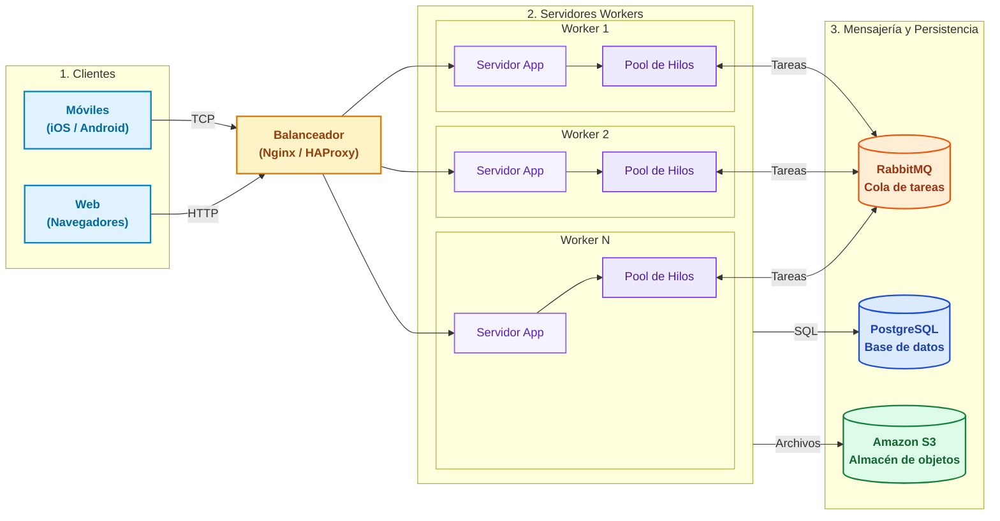

# Diagrama

```mermaid
flowchart LR
    %% Clases de estilo y colores
    classDef clientStyle fill:#E0F2FE,stroke:#0284C7,stroke-width:2px,color:#0369A1,font-weight:bold;
    classDef lbStyle fill:#FEF3C7,stroke:#D97706,stroke-width:2px,color:#92400E,font-weight:bold;
    classDef appStyle fill:#F5F3FF,stroke:#8B5CF6,stroke-width:1.5px,color:#5B21B6;
    classDef poolStyle fill:#EDE9FE,stroke:#7C3AED,stroke-width:1.5px,color:#4C1D95;
    classDef mqStyle fill:#FFEDD5,stroke:#EA580C,stroke-width:2px,color:#9A3412,font-weight:bold;
    classDef dbStyle fill:#DBEAFE,stroke:#1D4ED8,stroke-width:2px,color:#1E40AF,font-weight:bold;
    classDef s3Style fill:#DCFCE7,stroke:#15803D,stroke-width:2px,color:#166534,font-weight:bold;

    %% 1. Capa de Clientes
    subgraph CLIENTES["1. Clientes"]
        direction TB
        CM["Móviles\n(iOS / Android)"]:::clientStyle
        CW["Web\n(Navegadores)"]:::clientStyle
    end

    %% 2. Balanceador de Carga
    LB["Balanceador\n(Nginx / HAProxy)"]:::lbStyle

    %% 3. Servidores Workers
    subgraph SERVERS["2. Servidores Workers"]
        direction TB
        subgraph W1["Worker 1"]
            SA1["Servidor App"]:::appStyle --> PH1["Pool de Hilos"]:::poolStyle
        end
        subgraph W2["Worker 2"]
            SA2["Servidor App"]:::appStyle --> PH2["Pool de Hilos"]:::poolStyle
        end
        subgraph WN["Worker N"]
            SAN["Servidor App"]:::appStyle --> PHN["Pool de Hilos"]:::poolStyle
        end
    end

    %% 4. Mensajería y Almacenamiento
    subgraph BACKEND["3. Mensajería y Persistencia"]
        direction TB
        MQ[("RabbitMQ\nCola de tareas")]:::mqStyle
        DB[("PostgreSQL\nBase de datos")]:::dbStyle
        S3[("Amazon S3\nAlmacén de objetos")]:::s3Style
    end

    %% Conexiones cortas y directas
    CM -->|TCP| LB
    CW -->|HTTP| LB

    LB --> SA1
    LB --> SA2
    LB --> SAN

    PH1 <-->|Tareas| MQ
    PH2 <-->|Tareas| MQ
    PHN <-->|Tareas| MQ

    SERVERS -->|SQL| DB
    SERVERS -->|Archivos| S3
```
